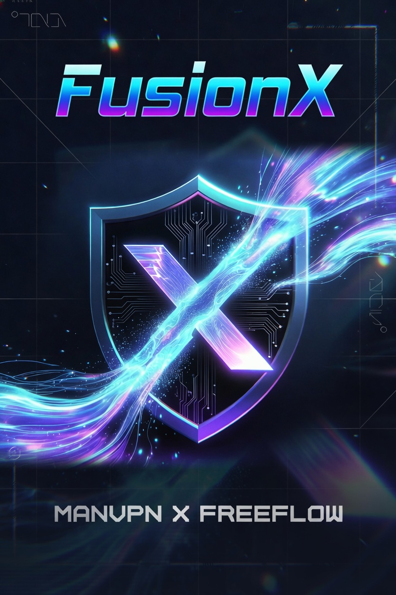

# FusionX VPN

**MANVPN × FREEFLOW** | Version 1.0.0

<p align="center">
  
</p>

## Overview

FusionX is a dual-core VPN client for Android that automatically detects protocol types and routes to the correct engine. It combines the best features of v2rayNG, NekoBox, and NetMod into a single, modern application.

## Architecture

### Core Detection Logic
FusionX auto-detects config type and routes to the correct engine:
- **VLESS/VMess/Trojan/SS/SSR** → Xray-core (`libxrayjni.so`)
- **VLESS-STRX** → Xray-core with STRX payload injection
- **Hysteria2/TUIC/WireGuard** → sing-box (`libsingboxjni.so`)

### STRX Protocol
STRX is a 2-phase HTTP payload injection transport:
```
Phase 1: GET /cdn-cgi/trace HTTP/1.1
         Host: wap.u.com.my    ← CDN SNI trick (bypasses DPI)
[SPLIT]
Phase 2: STRX / HTTP/1.1
         Host: [actual-host]
         Upgrade: websocket
         ...WebSocket upgrade headers
```

### Native Libraries
| File | Source | Purpose |
|------|--------|---------|
| libxrayjni.so | v2rayNG STRX mod | Xray-core + STRX transport |
| libsingboxjni.so | NekoBox 1.4.2 | sing-box (modern protocols) |
| libhev-socks5-tunnel.so | v2rayNG STRX | HEV SOCKS5 tun driver |
| libmmkv.so | v2rayNG STRX | Fast KV storage |

## Features

- [x] Auto protocol detection (VLESS, VMess, Trojan, SS, SSR, Hysteria2, TUIC, WireGuard)
- [x] STRX payload generic support
- [x] Dual core: Xray + sing-box
- [x] Import via paste / base64 / subscription URL
- [x] Deep link handling (vmess://, vless://, hy2://, etc.)
- [x] Custom background wallpaper
- [x] MANVPN × FREEFLOW watermark
- [x] Server latency testing
- [x] Dark theme (cyan/purple palette)
- [x] Group/filter server list
- [x] Traffic stats (upload/download)
- [x] Auto-connect on boot
- [x] NekoBox-style detailed settings

## Building

### Prerequisites
- Java 17 (OpenJDK)
- Android SDK 35 + Build-Tools 35.0.0
- Gradle 8.11.1

### Build Command
```bash
export JAVA_HOME=/usr/lib/jvm/java-17-openjdk-amd64
export ANDROID_HOME=/path/to/android-sdk
./gradlew assembleRelease
```

### APK Output
```
app/build/outputs/apk/release/app-release.apk
```

## Signing Info
- Keystore: `fusionx-release.keystore`
- Alias: `fusionx`
- Password: `fusionx2024`

## Phase B / C (Next Steps)
- [ ] Clash YAML subscription support
- [ ] sing-box full integration with native VPN tun
- [ ] Per-app routing (bypass list)
- [ ] Quick tile service
- [ ] SSH tunneling (Phase C)
